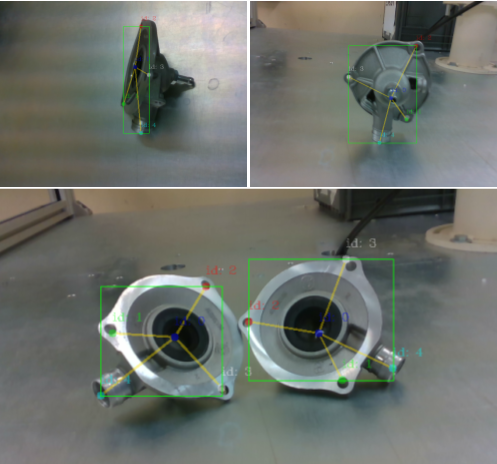

# Complex Geometry Part Topological Skeleton (CoGP-TS)

CoGP-TS is a library based on [Lightweight OpenPose](https://github.com/Daniil-Osokin/lightweight-human-pose-estimation.pytorch). This work replaces MobileNetV1 with MobileNetV3 and makes many changes in order to make it work with industrial parts with different views.

<p align="center">
  
</p>

## Table of Contents

* [Requirements](#requirements)
* [Prerequisites](#prerequisites)
* [Training](#training)
* [Python demo](#python-demo)
* [Citation](#citation)

## Requirements

* Ubuntu 22.04
* Python 3.7
* PyTorch 1.13

## Prerequisites

1. Annotate your images with the [COCO Annotator tool](https://github.com/jsbroks/coco-annotator) and split them in train and validation.
2. Install requirements `pip install -r requirements.txt`.
3. Download MobileNetV3 weights: [MobileNetV3 weights](https://drive.google.com/file/d/1rsLPZDxRWWv5gDE2GDneMmZLyMiZrTvj/view?usp=share_link). 

## Training

1. Convert train annotations in internal format. Run `python scripts/prepare_train_labels.py --labels your/dataset/your_annotations.json`. It will produce `prepared_train_annotation.pkl` with converted in internal format annotations.

   [OPTIONAL] For fast validation it is recommended to make *subset* of validation dataset. Run `python scripts/make_val_subset.py --labels your/dataset/your_annotations.json --num images`. It will produce `val_subset.json` with annotations just for *num* random images (out of the total training images). You can also directly use the json file from the annotation tool.

2. Edit the file `utils/config.py` and change it properly according to the annotations you made.

3. To train from MobileNet weights, run `python train.py --train-images-folder /path/to/the/training/image/folder --prepared-train-labels /path/to/prepared_train_annotation.pkl --val-labels /path/to/val_subset.json(or the /path/to/the/validation/json/file.json) --val-images-folder /path/to/the/validation/folder/ --checkpoint-path /path/to/mobilenetv3_small_67.4.pth.tar --from-mobilenet`

4. Next, to train from checkpoint from previous step, run `python train.py --train-images-folder /path/to/the/training/image/folder --prepared-train-labels /path/to/prepared_train_annotation.pkl --val-labels /path/to/val_subset.json(or the /path/to/the/validation/json/file.json) --val-images-folder /path/to/the/validation/folder/ --checkpoint-path /path/to/the/checkpoint.pth --weights-only`

Since there is no checkpoint selection, I suggest you to have a look at the validation metrics during the training.

## Python Demo <a name="python-demo"/>

We provide python demo just for the quick results preview. Please, consider c++ demo for the best performance. To run the python demo from a webcam:
* `python demo.py --checkpoint-path /path/to/checkpoint_iter_11000.pth --images /path/to/a/single/image or /path/to/a/folder/of/images/ or /path/to/a/video/file`

## Citation:

```
@Article{electronics13153021,
  AUTHOR = {Pennisi, Andrea and Sileo, Monica and Bloisi, Domenico Daniele and Pierri, Francesco},
  TITLE = {Selective Grasping for Complex-Shaped Parts Using Topological Skeleton Extraction},
  JOURNAL = {Electronics},
  VOLUME = {13},
  YEAR = {2024},
  NUMBER = {15},
  ARTICLE-NUMBER = {3021},
  URL = {https://www.mdpi.com/2079-9292/13/15/3021},
  ISSN = {2079-9292},
  ABSTRACT = {To enhance the autonomy and flexibility of robotic systems, a crucial role is played by the capacity to perceive and grasp objects. More in detail, robot manipulators must detect the presence of the objects within their workspace, identify the grasping point, and compute a trajectory for approaching the objects with a pose of the end-effector suitable for performing the task. These can be challenging tasks in the presence of complex geometries, where multiple grasping-point candidates can be detected. In this paper, we present a novel approach for dealing with complex-shaped automotive parts consisting of a deep-learning-based method for topological skeleton extraction and an active grasping pose selection mechanism. In particular, we use a modified version of the well-known Lightweight OpenPose algorithm to estimate the topological skeleton of real-world automotive parts. The estimated skeleton is used to select the best grasping pose for the object at hand. Our approach is designed to be more computationally efficient with respect to other existing grasping pose detection methods. Quantitative experiments conducted with a 7 DoF manipulator on different real-world automotive components demonstrate the effectiveness of the proposed approach with a success rate of 87.04%.},
  DOI = {10.3390/electronics13153021}
}
```
